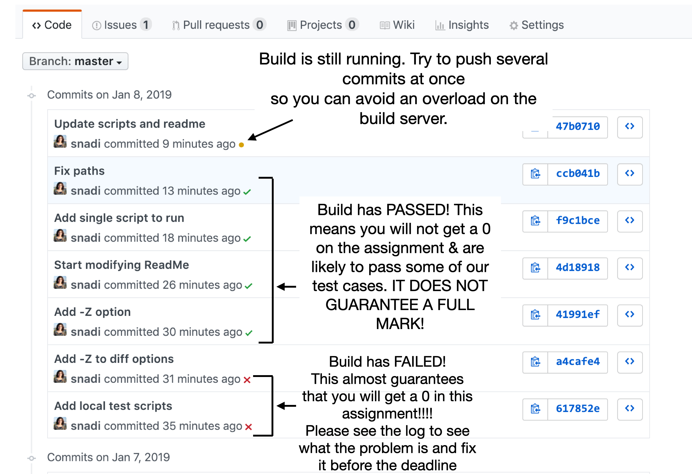
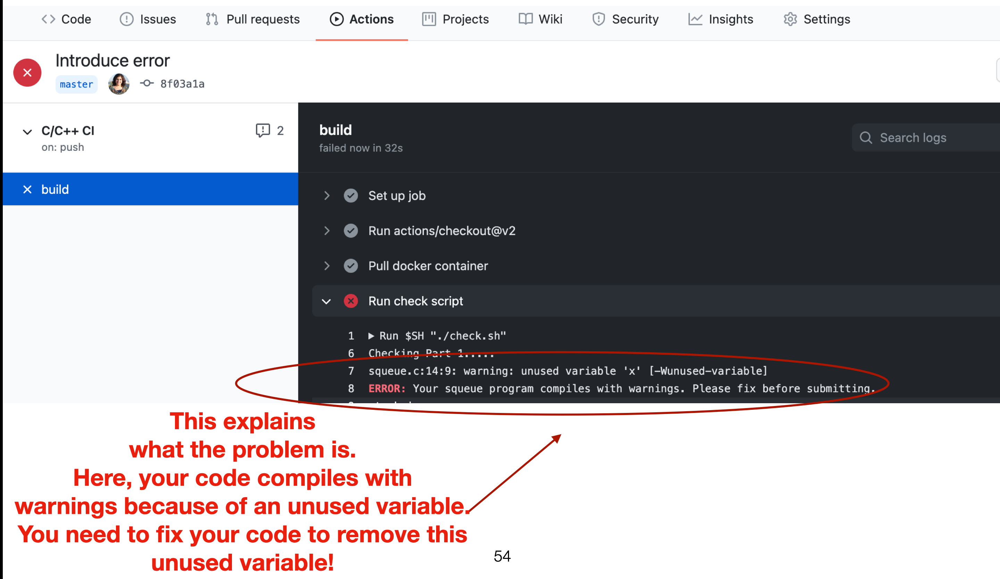

# Overview

This file describes the files provided to you in this repository. The assignment description is available on eClass.

# Files

DO NOT DELETE ANY OF THE FILES BELOW FROM YOUR REPO.

* `LICENSE.md`: contains the CMPUT 201 license. Please replace `<student name>` with your name.
* `RepoStructure.md`: this file
* `.github/workflows`: this is the GitHub Actions configuration that automates the continuous integration checking of your assignment with every push. You should never need to touch this file unless you really know what you are doing. We are not responsible for any changes you make to this file.
* `check.sh`: this is the checking script that will run with every push to check that all your required files are availble. It checks for the required files and memory leaks. It also checks (1) the final contents of the `Squeue` after exectuing the provided test case in `squeue_client.c` and (2) the final contents of the two stacks after executing the provided test case in `bucketstack_client.c`. If this script shows any warnings or errors, you are very likely to get a 0. You can also run this script locally by simply running `./check.sh` on the lab machine.
* `Part1/` and `Part2/` filders contain the header files you need to adhere to and a sample C client file for parts 1 and 2 of the assignment, respectively.
* `Part1/checksqueueprint.sh` checks that your squeue print function works correctly. This is called from the `check.sh` script. You do not need to change this file in any way.
* `Part2/checkbucketstackprint.sh` checks that your bucket print function works correctly. This is called from the `check.sh` script.  You do not need to change this file in any way.
* `images/`: ignore this folder. It is just the images used to explain things in this file.

# Notes about CI

* If you click on the `commits` tab shown at the top of your github repo, you will see the check/build status of your commits. See pic below for what each symbol means:

* Let's assume you get a red cross, which means there's something you need to fix. Click on that red cross, and then click on Details in the popup that appears. Scroll down in the webpage you go to and click on "View more details on Travis CI". It will take you to a page that shows the details of the build and you can figure out what's wrong similar to the figure below:

* As you develop your assignment, it is OK for the build status to remain as failing for a while until your code manages to pass all the tests and checks provided in the scripts. The important thing is that your build should pass (green check) before the deadline.
